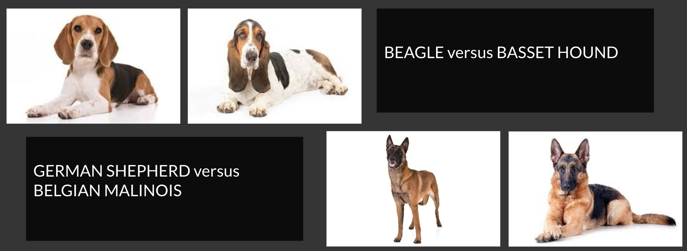

# What's that Doggie in the Window?
By: **Bryan Santos**

# Social Case

Have you ever wanted to know the breed of dogs you see in social media or with other people because you like how they look, whether tough or cute?

This project aims to build an application that lets users upload images of a dog and to get its breed. The application will then assess the breed characteristics if it is suitable for the user based on lifestyle. If it is, then the system will redirect the user to dogs of that particular breed that is up for adoption. If not compatible, then the the system will suggest top five most compatible breeds.

The project will utilize multi-class image classification and recommendation systems machine learning models to achieve its goals.

The pet industry is a multi-billion dollar industry even just in the United States alone. The trend of owning pets is on a steady rise. Unfortunately, so do the number of dogs that would be without a permanent home or that would be euthanized. Many people buy dogs because of fad or appearances and abandon them, most likely because they do not realize that dogs of different breeds have unique characteristics and may not necessarily match their lifestyles.

Many people buy dogs because of fad or appearances and abandon them, most likely because they do not realize that dogs of different breeds have unique characteristics and may not necessarily match their lifestyles. There is a need to match individuals with specific breeds and promote adoption of compatible breeds.

# Dataset

## Images

This version of the project focuses on the Top 50 breeds according to the American Kennel Club. There are a total of 9,500+ dog images collected through API calls and manual download. The sources of the images are www.dog.ceo, a site that provides API endpoints which returns images of various dog breeds. In addition, I downloaded the dog images dataset from a Udacity Nanodegree. 

## Dog Breed Characteristics

45 different breed characteristics of the dog breeds were scraped from www.dogtime.com. 31 out of the 45 characteristics are numeral ratings from one to five stars. 

## Dogs for Adoption

Details of 60,000+ actual dogs for adoption were scraped from www.petfinder.com.

# Repository Contents

This github repository contains the following files.

1. 01_web_scraping.ipynb - contains the main web scraping process used to gather the dog breed characteristics and dogs for adoptions datasets
2. 02_api_calls.ipynb - contains the API calls that were ran to download dog images from www.dog.ceo and Udacity
3. 03_clean_split_preprocess_data.ipynb - notebook that has all of the initial data preparations prior to EDA
4. 04_EDA.ipynb - contains deep-dive analysis of all the data sets gathered through visualizations and observations
5. 05_image_classification.ipynb - contains the actual step-by-step process in building multi-class image classification models
06. 06_recommendation_system.ipynb - contains the recommender models that matches user profile with dog breeds

# Data Understanding

## Class Distribution

Below is the class distribution of 50 different dog breeds.

There are a total of 50 breeds making this a complex multi-class image classification. Furthermore, there is also a wide disparity in the amount of images available for each class, resulting to an obvious class imbalance. 

There are various ways that I could deal with the class imbalance. I am predicting that our model to be build from scratch will perform very poorly given the lack of observations for half of the breeds. However, I am confident that using pre-trained models via Transfer Learning can help solve this problem. We will compensate the lack of images for some of the breeds by tapping into the other images that the pre-trained models have trained on.

## Peeking at the Images

Take a look at some of the sample images.

Given the wide variety of dogs as seen in the random images, this proves that there is indeed a need for a dog breed classifier. Normal folks would find it hard to identify a dog's breed because of the significant physical differences and the actual number of breeds there are.

## Image Sizes and Dimensions

Upon initial check of file sizes and dimensions, there were several outliers. The figures below zoom in on the majority of the files:

There are definite outliers when looking into the file size and dimensions of the images. Image quality does matter when tackling image classification but in order to avoid model biases and in the interest of efficiency, all images will be resized to standard measurements. 

## Dog Characteristics

The box plot below shows that there are actual substantial differences of characteristics among different dog breeds, which highlights the importance of matching them to compatible owners.

The correlation plot below will be used to formulate the least possible number of survey questions that would hit all 31 dog attributes.

## Dogs for Adoption

It is clear that puppies have faster turnarounds in shelters versus older dogs, which is depressing because even senior dogs deserve to have a happy home.

# Modeling Process

These were the steps undertaken in building the various image classification models.

1. Data Preparation - This includes train and validation splitting, converting into tensors, separating into batches.
2. Build Baseline Model - This uses Dummy Classifier to build a baseline model based on the most frequent class. This model will not generate any insight about the data.
3. Build CNN Model from Scratch - Build the model from scratch with the goal of beating the baseline model score.
4. Use Transfer Learning Models - Building a machine learning model and training it on lots from scratch can be expensive and time consuming. Transfer learning helps alleviate some of these by taking what another model has learned and using that information with your own problem.
5. Model Evaluation and Selection - Evaluating the best model through different metrics
6. Making Predictions - Seeing the models in action, by predicting on validation images and custom, user-provided images
7. Recommendation - Matching user lifestyle with dog breeds

# Metrics and Evaluation

In each round of modeling, I am using loss as the basis of which epoch is the best. But in models-to-models comparison, I am using accuracy as my final metric because I am not handling sensitive data where the balance between precision and recall matters. I will simply look at accuracy to check whether the model has correctly predicted a breed. 

The final image classification model has an accuracy of 91%, which is very good considering the lack of images of half of the breeds and the number of classes.

Meanwhile, the recommendation system will be using cosine similarity as basis for checking the compatibility of users with corresponding dog breeds. .8 similarity score is the threshold of compatibility.

# Predictions

## Predicting Validation Data

Predictions show the true label versus the probabilities of all other predictions.

## False Predictions

Looking closely at the false predictions, the primary reason they are failing is because of uncanny physical and appearance similarities between two of the breeds. 

# Further Improvements

1. Try other pre-trained models
2. Data augmentation (crop, resize, distort, flip, rotate)
3. More fine-tuning using dogs images
4. Include all other breeds not just top 50

# Front End

Below is sample screenshot of the user survey in the front end of this project.

# Sources

## Datasets
1. https://www.dogtime.com
2. https://www.petfinder.com
3. https://www.dog.ceo
4. Udacity Nanodegree

## Others
1. https://www.geeksforgeeks.org/ml-dummy-classifiers-using-sklearn/
2. https://www.petsecure.com.au/pet-care/a-guide-to-worldwide-pet-ownership/
3. https://www.aspca.org/animal-homelessness/shelter-intake-and-surrender/pet-statistics